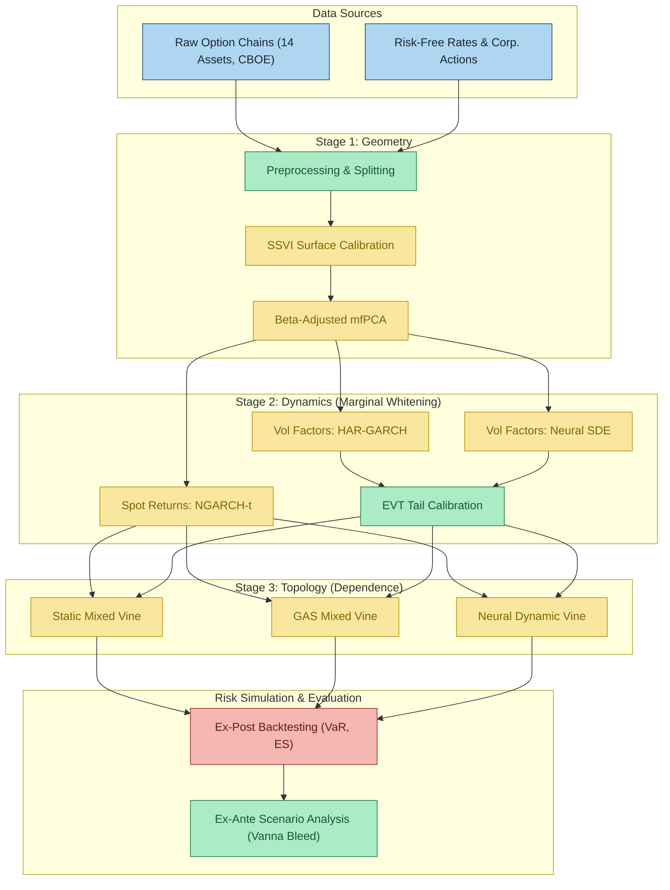

# Leverage and Contagion Effects in Implied Volatility Surfaces: A Mixed Neural Vine Copula Approach
_Project by Luca Leimbeck Del Duca | **Partner Firm:** Optiver_

This project introduces a unified deep generative framework to forecast the joint evolution of implied volatility surfaces across a high-dimensional universe of assets. By decomposing the forecasting problem into geometry, dynamics, and topology stages, the study demonstrates improved modeling of asymmetric tail dependence and contagion effects, significantly outperforming traditional static and Gaussian benchmarks. 

## Abstract 
Forecasting the joint evolution of implied volatility surfaces across a high-dimensional universe of assets is a critical challenge for market makers, particularly during periods of systemic stress. Traditional econometric models often struggle to reconcile the arbitrage-free geometry of the surface with the complex, non-linear dependence structure of asset returns. This paper proposes a unified deep generative framework that decomposes the joint forecasting problem into three sequential stages: geometry, dynamics, and topology. First, the surface stochastic volatility inspired (SSVI) parameterization and beta-adjusted multilevel functional principal component analysis are employed to construct an arbitrage-free, low-dimensional market representation. Second, the temporal evolution of the extracted factors is modeled using neural stochastic differential equations (NSDE), which capture path-dependent memory structures without imposing the rigid parametric constraints of standard linear benchmarks. Finally, the high-dimensional, asymmetric dependence structure is estimated via a novel differentiable mixed regular vine copula. Evaluating this framework across a diverse panel of 14 assets reveals that the dynamic neural topology significantly outperforms benchmarks in capturing asymmetric tail dependence and passing strict conditional coverage criteria. Furthermore, ex-ante delta-hedging simulations accurately isolate the systematic vanna bleed, proving the economic value of correctly specifying high-dimensional market contagion.

## Structure

The repository is structured into distinct sub-modules that strictly mirror the methodological stages described in the study.

First, the `src/preprocessing/` module handles data wrangling, filtering out arbitrage violations from raw option quotes, and constructing the risk-free rate curves. 

Next, under the geometry stage, `src/fitting/` contains the SSVI calibration engine. This engine utilizes differential evolution and Sequential Least Squares Programming (SLSQP) to generate continuous, arbitrage-free volatility surfaces. The `src/compression/` module then implements beta-adjusted multilevel functional PCA ($\beta^{adj}$-mfPCA) to separate global market factors from idiosyncratic residual surfaces.

For temporal evolution, the `src/dynamics/` module contains the marginal filtration models. This includes NGARCH-t filters for spot returns, HAR-GARCH econometric baselines, the deep generative Neural SDE networks (NSDE), and Extreme Value Theory (EVT) tail calibration functions. 

The `src/dependence/` directory implements the topological network structure. It includes the structural decay truncation heuristics and unified Differentiable Vine architectures for both score-driven Generalized Autoregressive Score (GAS) models and the deep generative neural vine configurations.

Finally, the `src/backtesting/` module contains the evaluation logic, providing scripts for ex-post portfolio simulations and ex-ante economic risk forecasts. This includes the specific hedging calculations for a directional leverage portfolio (Portfolio 1) and a cross-asset vega-neutral dispersion portfolio (Portfolio 2) alongside utilities for Black-Scholes pricing and risk metric computations.

To run the code, execute the pipeline sequentially across the data preprocessing, fitting, dynamics, dependence, and backtesting scripts to replicate the full evaluation methodology.

## Project Flowchart

